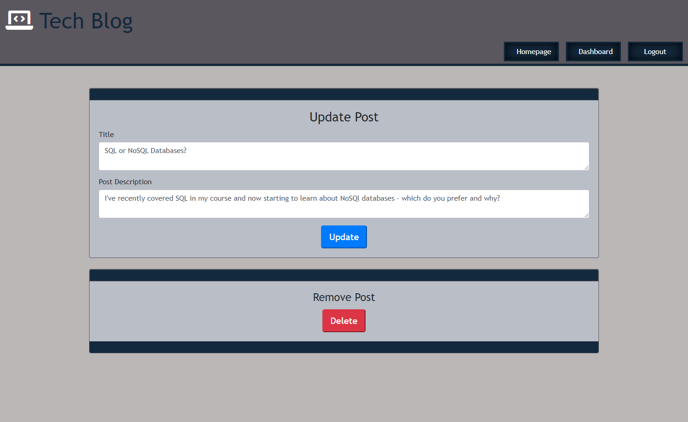

# Tech Blog [](https://opensource.org/licenses/MIT)  
  
  ## Table of Contents  
  * [Description](#description)
  * [Installation](#installation)
  * [Usage](#usage)
  * [Deployed Application](#deployed-application)
  * [Screen Shots](#screen-shots)
  * [Tests](#tests)
  * [Technologies Used](#technologies-used)  
  * [Questions](#questions)
  * [How to Contribute](#How-to-Contribute)   
  * [License](#license)
  
  ## Description

 The motivation behind this project was to build a CMS-style blog site application  where developers can publish their blog posts and comment on other developers posts too. The Tech Blog Application follows the model, view controller (MVC) paradigm, uses Handlebars as the templating language, Sequelize as the ORM, SQL database and the expression-session npm package for authentication. The application has been deployed using heroku. 

  
       
  ### Functional Requirements

  The functional requirements that the Tech Blog application has been designed to meet are defined by the user story and acceptance criteria listed below.  

  #### User Story

 ```md
AS A developer who writes about tech
I WANT a CMS-style blog site
SO THAT I can publish articles, blog posts, and my thoughts and opinions
```

 

#### Acceptance Criteria

```md
GIVEN a CMS-style blog site
WHEN I visit the site for the first time
THEN I am presented with the homepage, which includes existing blog posts if any have been posted; navigation links for the homepage and the dashboard; and the option to log in
WHEN I click on the homepage option
THEN I am taken to the homepage
WHEN I click on any other links in the navigation
THEN I am prompted to either sign up or sign in
WHEN I choose to sign up
THEN I am prompted to create a username and password
WHEN I click on the sign-up button
THEN my user credentials are saved and I am logged into the site
WHEN I revisit the site at a later time and choose to sign in
THEN I am prompted to enter my username and password
WHEN I am signed in to the site
THEN I see navigation links for the homepage, the dashboard, and the option to log out
WHEN I click on the homepage option in the navigation
THEN I am taken to the homepage and presented with existing blog posts that include the post title and the date created
WHEN I click on an existing blog post
THEN I am presented with the post title, contents, post creator’s username, and date created for that post and have the option to leave a comment
WHEN I enter a comment and click on the submit button while signed in
THEN the comment is saved and the post is updated to display the comment, the comment creator’s username, and the date created
WHEN I click on the dashboard option in the navigation
THEN I am taken to the dashboard and presented with any blog posts I have already created and the option to add a new blog post
WHEN I click on the button to add a new blog post
THEN I am prompted to enter both a title and contents for my blog post
WHEN I click on the button to create a new blog post
THEN the title and contents of my post are saved and I am taken back to an updated dashboard with my new blog post
WHEN I click on one of my existing posts in the dashboard
THEN I am able to delete or update my post and taken back to an updated dashboard
WHEN I click on the logout option in the navigation
THEN I am signed out of the site
WHEN I am idle on the site for more than a set time
THEN I am able to view comments but I am prompted to log in again before I can add, update, or delete comments
```


  ## Installation
  
  After cloning the application follow the instructions below to install the application:

    
  Install dependancies:

       npm i

  In order to connect mySQL to the database you will need to create a .env file in the project root directory that includes the following code:

    DB_NAME='techBlog_db'
    DB_USER='root'
    DB_PASSWORD=<'your password'>     

  

 ## Usage

- On entering the Tech Blog website a user a presented with existing blog posts. In order to add a post or comment on an existing post the user must wither sign-up or login.
- After a user has logged  or signed-up, the user is presented with their dashboard where they can view their own posts or add a new post. 
- Once logged in the buttons on the website header and the links on the post titles in teh Tech Blog homepage become active, allowing the user to view post comments. The login button changes to  logout whilst the user is logged in.
- To view the comments for a particular post, from the Tech Blog home page, click on the post title - the post will be displayed along with posted comments and the user is able to:
  - Add a comment to the post.
  - Edit their own comments - update or delete.
- A user can view their own posts by clicking on the Dashboard button at the top of the page. Posts belonging to the user will displayed and they have the option to;
  - Add a new post
  - Edit an existing post -  clicking on the post title gives the user the option to either update or delete a post.
- A user is signed into the Tech Blog until their session expires or they logout.  This means a user is still able to access the site if they are idle for a period of time and their logged in session has not expired. 
  
  

 ## Deployed Application

   Click on the link below to view the Tech Blog Application.

   - [Tech Blog application](https://secret-harbor-71774.herokuapp.com/)

   

  ## Screen Shots

  

Tech blog landing page - users must either login or sign-up to view comments, add posts and make edits to their posts and comments.

 

 User Login page. After logging in a user is redirected to their dashboard.

 

 User signing-up page. After registering to use the site a user is redirected to their dashboard.


User dashboard.  A user has the option to add a new post.  After adding a new post, the dashboard will be updated with the new post.

  

By clicking on the post title from the user dashboard, a user is able to update or delete their post.


A logged in user is able to click on a post title from the Tech Blog home page, where they will be redirected to a page that displays the post and associated comments. 


  
 Post with comments and option to add a comment. A user is able to update or delete their own comments. 


A user is able to edit or delete their comment


  ## Tests
  No code tests have been implemented.

  ## Technologies Used
  - JavaScript
  - Css
  - Bootstrap
  - Handlebars
  - MySQL
  - Node Js
  - Heroku
  - Sequelize
  - express
  - mysql2  
  - Bcrypt
  - dotenv
  

  - dotenv npm package
  
  ## Resources
    
  - How to add key value pairs to all objects in an array: [https://stackoverflow.com/questions/39827087/add-k- key-value-pair-to-all-objects-in-array](https://stackoverflow.com/questions/39827087/add-key-value-pair-to-all-objects-in-array)

  - Logical operators in a handlebars {{#if}} conditional: (https://stackoverflow.com/questions/8853396/logical-operator-in-a-handlebars-js-if-conditional)

  - Handlebars builtin helper functions: [(https://handlebarsjs.com/guide/builtin-helpers.html#if)](https://handlebarsjs.com/guide/builtin-helpers.html#if)  

  - Window location cheat sheet: [(https://www.samanthaming.com/tidbits/86-window-location-cheatsheet/)](https://www.samanthaming.com/tidbits/86-window-location-cheatsheet/)

  
 
  ## Questions
  If you have any questions regarding this project or contents of this repository, please contact me via:
  
  - email: dat826@gmail.com
  - GitHub: [Beanalini](https://github.com/Beanalini)  


  
  ## Contributing
  If you would like to contribute to this project you can contact me by email at dat826@gmail.com or through my GitHub account   @[Beanalini](https://github.com/Beanalini).
  

  ## License
  This project is covered under the MIT License  
  
  [](https://opensource.org/licenses/MIT) 
  